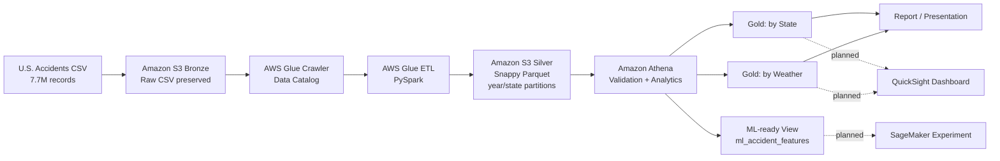

# AWS Medallion Architecture

This diagram shows the architecture we actually implemented and separates it from the planned extensions.

## Implemented

- Amazon S3 Bronze
- AWS Glue Crawler / Data Catalog
- AWS Glue PySpark ETL
- Amazon S3 Silver
- Snappy-compressed Parquet
- `accident_year` / `state` partitioning
- Amazon Athena
- `gold_accidents_by_state`
- `gold_accidents_by_weather`
- `ml_accident_features`

## Planned

- QuickSight dashboard
- SageMaker classification experiment
